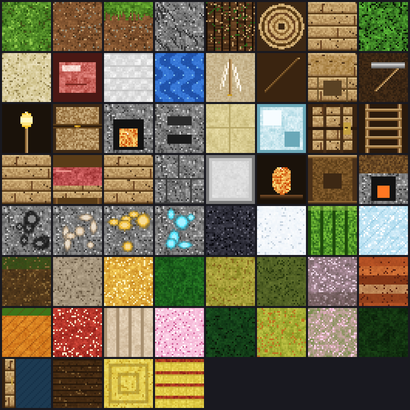
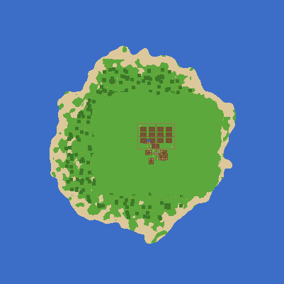
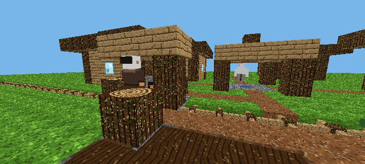

# MinecraftTest

## ▶️ Играть

**https://rawcdn.githack.com/Mihail007p/MinecraftTest/arena/01a0432c-minecrafttest/index.html**

(githack один раз спросит подтверждение — нажми «Open the page»)

Без подтверждения:
**https://htmlpreview.github.io/?https://github.com/Mihail007p/MinecraftTest/blob/arena/01a0432c-minecrafttest/index.html**

---
Мобильная веб-версия Minecraft-подобной песочницы (один файл `index.html`, Three.js внутри).

## Запуск через githack

Основная ссылка — **rawcdn** (боевой CDN githack, кэш, быстрый на телефоне):

```
https://rawcdn.githack.com/Mihail007p/MinecraftTest/arena/01a0432c-minecrafttest/index.html
```

Запасная — dev-домен githack (он лимитирует трафик и на большом файле часто
отваливается, поэтому он именно запасной):

```
https://raw.githack.com/Mihail007p/MinecraftTest/arena/01a0432c-minecrafttest/index.html
```

**Важно:** для HTML-страниц githack сначала показывает свою заставку
«One more step / External Content Notice». Надо один раз нажать зелёную кнопку
**«Open the page»** — после этого откроется игра, и браузер запомнит согласие,
дальше ссылка будет открываться сразу. Убрать эту заставку со стороны
репозитория нельзя — это политика самого githack для HTML.

## Если заставка мешает — ссылки без неё

htmlpreview (проверено, открывается сразу):

```
https://htmlpreview.github.io/?https://github.com/Mihail007p/MinecraftTest/blob/arena/01a0432c-minecrafttest/index.html
```

GitHub Pages — самый быстрый вариант, включается один раз:

1. https://github.com/Mihail007p/MinecraftTest/settings/pages
2. **Source** → `Deploy from a branch`
3. **Branch** → `arena/01a0432c-minecrafttest`, папка `/ (root)` → **Save**
4. Через 1–2 минуты игра будет тут: **https://mihail007p.github.io/MinecraftTest/**

## Локально

```bash
git clone https://github.com/Mihail007p/MinecraftTest.git
cd MinecraftTest
python3 -m http.server 8080
# открыть http://localhost:8080/index.html
```

Или скачать `index.html` и открыть его в Chrome (Загрузки → открыть в браузере) —
файл самодостаточный, интернет для игры не нужен.

> ⚠️ jsDelivr (`cdn.jsdelivr.net`) не подходит: он отдаёт HTML как обычный
> текст, игра не запускается.

## Текстуры



Все текстуры генерируются кодом при запуске (32x32 на блок), атлас собирается
в canvas 256x1024 с полями вокруг каждого тайла — поля нужны для мип-уровней,
иначе вдали тайлы размазываются друг в друга.

## Качество картинки

Кнопка справа под 🧪 переключает режим (выбор запоминается):

| Режим | Что делает | Для чего |
|---|---|---|
| **АВТО** | движок сам держит баланс, подстраивает разрешение под FPS | по умолчанию на слабых телефонах |
| **HD** | кадр рисуется ровно в физическом разрешении экрана (на Pova Neo 3 это 1600×720) | чёткая картинка без мыла |
| **4K** | суперсэмплинг: кадр рисуется крупнее экрана (до 2.5× плотности) и уменьшается при выводе | максимально гладкие края блоков |

Если телефон не тянет выбранный режим, игра сама шагнёт вниз (4K → HD → АВТО),
чтобы не превратиться в слайд-шоу.

## Как проверялся мир

В `devtools/` лежит headless-стенд: движок запускается в Node без браузера,
что позволяет мерить генерацию, рисовать карту мира и делать программные
скриншоты без телефона.

```bash
python3 devtools/extract.py     # вытащить three.js и код игры из index.html
node devtools/check.js          # тайминги, число вершин, ошибки кадров
node devtools/surface.js 60     # из чего состоит поверхность вокруг спавна
node devtools/map.js 200        # карта мира сверху -> _worldmap.png
node devtools/render.js 22 6 200 -8 720   # программный скриншот -> _view.png
node devtools/dump_tiles.js     # лист всех текстур -> _tiles_preview.png
```

### Стенд умеет мерить «дрожание»

```bash
node devtools/walk.js   # симулирует ходьбу с неровными кадрами и меряет
                        # рывки камеры (вторая производная высоты)
```



